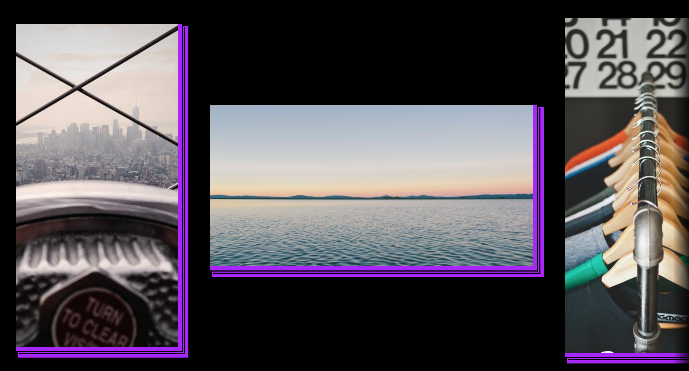

# Yet Another Slider

Let's use flexbox to create a simple slider that can be scrolled horizontally.

- [x] Images have various sizes (both portrait and landscape)
- [x] Slider can scroll horizontally (but not vertically)

Take a look at the example:


## Extra

- [x] Images have a purple border effect
- [x] There is an overlay on each sides, that indicate there is content to be scrolled

Take a look at the example:



---

You can use https://picsum.photos/ to get random pictures of various sizes, like so:

```
https://picsum.photos/200/300
```

The first number after the `https://picsum.photos/`
is the width, and the second is the height (`https://picsum.photos/:width/:height`).
